  

  <a href="#aboutwindow"><b>About</b></a>
  |
  <a href="#linkswindow"><b>Links</b></a>
  |
  <a href="#techwindow"><b>Tech</b></a>
  |
  <a href="#statswindow"><b>Stats</b></a>

<table>
  <tr>
    <td width="58%" valign="top">
      
      <h3><samp>about.window</samp></h3>
      

        Hey there, I am Rodrigo Sandler, a tech enthusiast currently focused on CS studies at PUCRS.
      

      

        I like building full-stack projects and interfaces with playful visual systems: bold borders,
        bright color blocks, window cards, polaroid framing, and small motion details.
      

    </td>
    <td width="42%" valign="top">
      
      <h3><samp>links.window</samp></h3>
      

        
        
      

      

        This profile README uses a local animated SVG, so it works inside GitHub without JavaScript.
      

    </td>
  </tr>
</table>

<table>
  <tr>
    <td width="50%" valign="top">
      
      <h3><samp>tech.window</samp></h3>
      

        
        
        
        
        
        
        
      

    </td>
    <td width="50%" valign="top">
      <h3><samp>design.window</samp></h3>
      

        <code>#22F2FF</code> cyan 
        <code>#FFDD22</code> yellow 
        <code>#22FFA2</code> green 
        <code>#C6B2EF</code> purple 
        <code>#F5E27B</code> button yellow
      

    </td>
  </tr>
</table>

## <samp>stats.window</samp>

  
  

